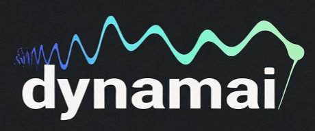

  

Dynamai is a *research and innovation group* focusing on exploring and developing ideas and concepts at the interface of dynamical systems and artificial intelligence (AI). Rooted in academia rigor, we are obssessed with anything that has to do with dynamical systems and AI. We are excited to turn our obsession into not only academic publications but also products/services in the form of impactful real world contributions! 
 

## Missions
Dynamai strives to:
- To explore foundational topics at the interface of dynamical systems and AI 
- To produce state-of-the-arts research results and softwares at the interface of dynamical systems and AI
- To share and disseminate knowledge and information about the latest progress in research at this interface  
- To provide education and consulting services to other institutions and industrial partners

## Services
- Research
- Education   
- Software developing
- Private consulting

## Projects 
Check out our reading list [here](https://shoelim.github.io/DSxML/)! Until then, stay tuned!
 

## People 
- Group founder and leader: [Soon Hoe Lim](https://shoelim.github.io/), Assistant Professor at KTH and Nordita
- Other members: we are currently hiring two postdocs, two PhD students and several master students to join the group!

## Contact 
We are happy to hear from you! For any enquiries and comments, please contact us via the email address: soon DOT hoe DOT lim AT su DOT se. 
